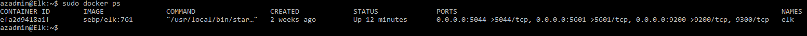

## Automated ELK Stack Deployment

The files in this repository were used to configure the network depicted below.

These files have been tested and used to generate a live ELK deployment on Azure. They can be used to either recreate the entire deployment pictured above. Alternatively, select portions of the Ansible file may be used to install only certain pieces of it, such as Filebeat.

  - `[Ansible Playbooks](https://github.com/Contestest/ELK-Stack/tree/main/Ansible)`

This document contains the following details:
- Description of the Topologu
- Access Policies
- ELK Configuration
  - Beats in Use
  - Machines Being Monitored
- How to Use the Ansible Build

### Description of the Topology

The main purpose of this network is to expose a load-balanced and monitored instance of DVWA, the D*mn Vulnerable Web Application.

Load balancing ensures that the application will be highly available, in addition to restricting access to the network.
- _Load Balancers help with the availability of your servers and prevent DDoS Attacks._
- _A Jump Box allows you to manage multiple servers from a single machine and restrics outside connections to your servers._

Integrating an ELK server allows users to easily monitor the vulnerable VMs for changes to the event logs and system metrics.
- _Filebeat monitors event logs and forwards them onto Elasticsearch_
- _Metricbeat records metrics and statistics and sends them to Elasticsearch_

The configuration details of each machine may be found below.

|    Name    |    Function   | IP Address | Operating System |
|:----------:|:-------------:|:----------:|:----------------:|
|   Jump box |    Gateway    |  10.0.0.11 |       Linux      |
|    Web-1   |   Web Server  |  10.0.0.10 |       Linux      |
|    Web-2   |   Web Server  |  10.0.0.9  |       Linux      |
| Elk Server | Elk Dashboard |  10.1.0.4  |       Linux      |

### Access Policies

The machines on the internal network are not exposed to the public Internet. 

Only the Jump Box machine can accept connections from the Internet. Access to this machine is only allowed from the following IP addresses:
- _My Public IP Address_

Machines within the network can only be accessed by the Jump Box.
- _The ELK VM can only be accessed by the Jump Box. IP Address 10.0.0.11_

A summary of the access policies in place can be found in the table below.

|   Name   | Publicly Accessible | Allowed IP Addresses |
|:--------:|:-------------------:|:--------------------:|
| Jump box |         Yes         |     My Public IP     |
|   Web-1  |          No         |       10.0.0.11      |
|   Web-2  |          No         |       10.0.0.11      |
|    Elk   |          No         |       10.0.0.11      |

### Elk Configuration

Ansible was used to automate configuration of the ELK machine. No configuration was performed manually, which is advantageous because...
- _Ansible allows you to set up multiple identical machines simultaneously with one command_

The playbook implements the following tasks:
- _Installs docker.io_
- _Installs Python_
- _Installs the Docker Module_
- _Increases the virtual memory_
- _Downloads and launches the ELK container_
- _Enables the Docker service on boot_

The following screenshot displays the result of running `docker ps` after successfully configuring the ELK instance.

### Target Machines & Beats
This ELK server is configured to monitor the following machines:
- _10.0.0.9
- _10.0.0.10_

We have installed the following Beats on these machines:
- _Filebeat_
- _Metricbeat_

These Beats allow us to collect the following information from each machine:
- _Filebeat has modules such as `Sudo commands ECS` which allows you to collect data on which sudo commands are being executed on your systems._
- _Metricbeat has modules such as `File Storage Overview` which shows metrics for file storage types in your system._

### Using the Playbook
In order to use the playbook, you will need to have an Ansible control node already configured. Assuming you have such a control node provisioned: 

SSH into the control node and follow the steps below:
- Copy the Filebeat configuration file to your web VM's at `/etc/filebeat/filebeat.yml`.
- Update the filebeat configuaration file to include the IP address of your ELK machine.
- Run the playbook, and navigate to the Filebeat installation page on the ELK server GUI to check that the installation worked as expected.

_TODO: Answer the following questions to fill in the blanks:_
- _`filebeat-playbook.yml` needs to be copied to `/etc/ansible/roles/` directory on your Ansible machine
- _Update the `hosts` option at the top of the `filebeat-playbook.yml` file on your Ansible machine to include one of two groups, webservers or elk._
- _Which URL do you navigate to in order to check that the ELK server is running?
- _Navigate to http://[ELK Server Public IP]:5601/app/kibana_